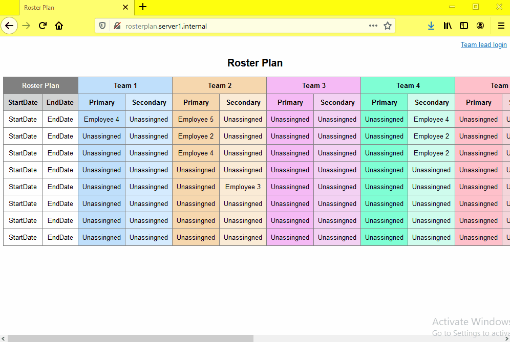

# Roster-Server
New web server that designed to manage rosters online

## Features
* Users can perform all roster operations online by deploying this software in their servers.
* Can be accessed through browsers
* Special access for team leaders

## Security features
* **It uses its own protocol for communication between browsers and server**
* No external dependency
* Password authentication for team leaders
* Takes data backup on every update
* Detailed server log

